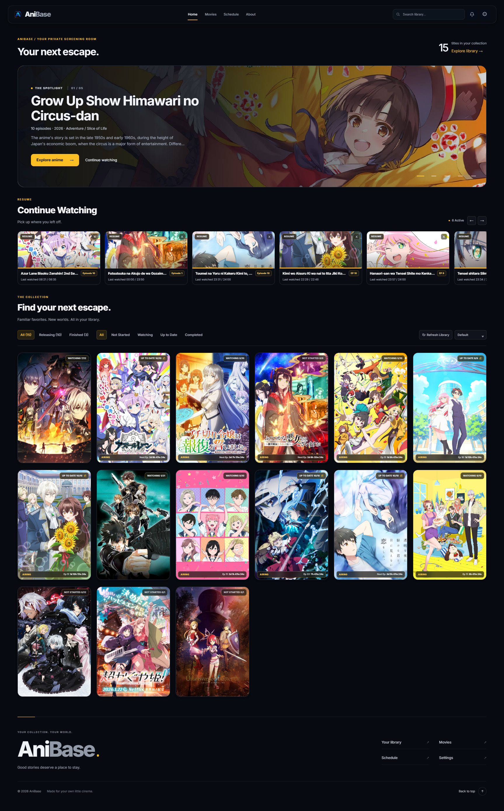
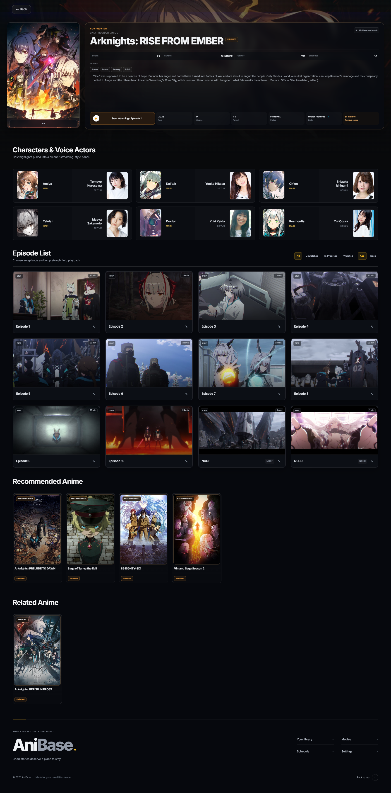

# AniBase

A private streaming library for your local anime and movies, with a web dashboard and a Windows/Linux tray launcher. Your media stays on your machine.

[Download releases](https://github.com/anzutm/anibase-local/releases) · [Third-party notices](THIRD_PARTY_NOTICES.md)

## Features

- Browse anime, movies, seasons, studios, voice actors, and airing schedules.
- Fetch metadata from AniList, with Tenrai as a fallback and manual matching available.
- Resume playback, track watch progress, and automatically import downloaded episodes.
- Render fansub ASS subtitles with positioning, effects, and embedded MKV fonts; use Inter when the requested font is unavailable, or WebVTT when ASS rendering is unavailable.
- Use theme presets, optional Discord Rich Presence, external players, and controlled LAN access.

<details>
<summary>Preview screenshots</summary>





</details>

## Get started

Download and extract a release, then run `AniBase.exe` on Windows or `./AniBase` on Linux. Windows portable releases include FFmpeg and FFprobe; no separate Python installation is needed for executable releases.

Open the dashboard from the tray or visit **http://127.0.0.1:5000/**. On first launch, choose your anime folders and theme. Configure movies, auto-import, external players, and LAN access in Settings. Metadata fetching requires internet access.

If a video cannot play in the browser, try the external-player option. Codec support depends on the browser and operating system. Native fullscreen/PiP may use basic subtitles instead of full ASS styling.

## Run from source

Use **Python 3.12.x**. On Windows:

```powershell
git clone https://github.com/anzutm/anibase-local.git
cd anibase-local
powershell -ExecutionPolicy Bypass -File .\setup_dev.ps1
.\.venv\Scripts\Activate.ps1
python tray_ui.py
```

The setup script installs Python dependencies and checks FFmpeg/FFprobe. Recreate an existing virtual environment if it uses another Python version. To run only the web server, use `python main.py`.

On Linux, create and activate a Python 3.12 virtual environment, install `requirements.txt`, and ensure `ffmpeg`/`ffprobe` are on `PATH` before running `python tray_ui.py`.

## Build a release

Prepare the development environment first. Builds require Python 3.12, PyInstaller 6.11+ (below 7), and FFmpeg/FFprobe on `PATH`. Build on the target operating system.

```powershell
python build.py --check
python build.py v1.3.4 --exe-only
python release_check.py
```

Replace `v1.3.4` with your release version. `--check` validates prerequisites without building or changing output. The release checker checks the latest executable release; also launch the app and test playback before distributing it.

Output: `releases/AniBase v<version>/` and a platform-specific ZIP or TAR.GZ archive. Packages include player assets, the ASS renderer, fonts, and licenses, with asset integrity checked before publishing.

If compilation succeeds but packaging fails, reuse `dist/AniBase` without compiling again:

```powershell
python build.py v1.3.4 --package-existing --check
python build.py v1.3.4 --package-existing
```

Other options:

- `--source-only`: create a source folder; the destination machine needs Python and FFmpeg/FFprobe.
- `--keep-temp`: retain compilation output. `--package-existing` always preserves `dist`.
- `python release_check.py --project-only`: check source and unit tests without a built release.

Choose only one of `--exe-only`, `--source-only`, or `--package-existing`. Without a mode, failed executable builds fall back to a source package. Failed packaging retains staging output at the path reported in the terminal.

## Local data

Settings, cache, database, watch history, logs, and temporary files are stored in:

- **Windows:** `%LOCALAPPDATA%\AniBase\`
- **Linux:** `$XDG_DATA_HOME/AniBase`, or `~/.local/share/AniBase` by default.

For project-local development data, set `ANIBASE_USE_PROJECT_RUNTIME=1` before launching. Keep runtime data and media out of Git and release packages. AniBase is for personal/local use; do not expose its server directly to the public internet.

## License

AniBase is [MIT licensed](LICENSE). Bundled libraries, fonts, and media tools retain their own licenses; see [Third-Party Notices](THIRD_PARTY_NOTICES.md).
